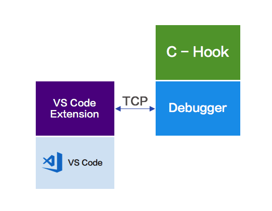
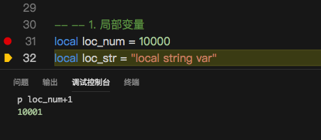

# 一些特性的实现方案


## 简述

LuaPanda 是一个基于VSCode的lua代码调试器，主要由三部分组成。



+ 调试器前端是VScode扩展，作用是通知VScode展示信息和进行数据交换。

+ 调试器后端是debugger，它负责调试主体功能的实现，使用lua开发。

+ 另外提供了一个可选的，用来提高调试效率的c-hook扩展模块。这个模块依赖于debugger，不能独立使用。


## 调试器工作原理

lua语言自身提供了基本的调试接口。调试器要做的是：把从lua虚拟机获取到的调试信息进行分析，整合，并控制代码的执行。

调试器依赖的核心接口：

```
debug.sethook ([thread,] hook, mask [, count])
```

lua虚拟机可以接受调试器设置的钩子函数，当代码执行到指定状态（mask: call , line , return）时就调入钩子函数，并附带以下信息

```
typedef struct lua_Debug {
  int event;
  const char *name;           /* (n) 函数名*/
  const char *namewhat;       /* (n) 用于解释 name 域. 可以是 "global", "local", "method", "field", "upvalue", 或是 "" （空串）。 这取决于函数怎样被调用*/
  const char *what;           /* (S) 类型 lua/c/main */
  const char *source;         /* (S) 路径*/
  int currentline;            /* (l) 当前行*/
  int linedefined;            /* (S) 函数定义行*/
  int lastlinedefined;        /* (S) 函数结束行*/
  unsigned char nups;         /* (u) number of upvalues */
  unsigned char nparams;      /* (u) number of parameters */
  char short_src[LUA_IDSIZE]; /* (S)  一个“可打印版本”的 source */
  /* private part */
  other fields
} lua_Debug;
```

钩子函数由调试器实现，其中做断点命中判断，单步操作等处理。

若命中断点，调试器阻塞被调试lua代码的执行，并获取变量和堆栈信息发给前端展示。


## 状态分级

hook状态分级的目标是希望减少hook次数，但是不能影响判断的准确性。

lua支持三种hook状态，lcr(line , call , return)。最初的方案三种状态全都要进行hook


调试器有多种执行状态，在用户感知的卡顿发生在Run。从上面的状态图可以看到，Run状态hook下的工作是做命中断点判断。

假如用户没有设置断点，那就没有必要做断点判断，只要定时接收消息（如用户新增断点）。

再假如用户设置了断点，但是当前执行的函数中没有断点，那么只需要在发生函数切换时（call，return）hook, 并根据新函数中是否有断点改变hook状态.

根据上面思想，我们建立了hook状态机，把hook分成以下状态


每次用户打断点，以及发生函数 call 和 return 时，都要重新检查，根据断点情况切换到对应状态，以免漏过断点。


## attach模式

lua中没有多线程给网络连接造成了一些难题，因为在网络请求处如果做同步等待连接会造成界面卡死。

最初的想法是：调试器被引用后，启动时会做一次connect，尝试连接VSCode。若失败则不再链接。这种方式必须在lua启动时就建立连接，但如果想要实现调试器的attach模式要怎样做呢？

因为纯lua没有异步和定时器，所以需要在运行过程中不断发请求。我们让hook每隔一定调用次数时尝试做一次连接。           
debug.sethook(this.debug_hook, "r", 1000000); 
因为连接有性能损耗，同时也做时间判断，距上次少于1s不再重连。
这种方式带来的优点是运行过程中随时可以挂载调试器开始调试。缺点是每隔1s都会尝试重连，有性能损耗。

对于性能损耗的问题，我们也做了一个设置项让用户选择是否使用attach模式。


## 执行表达式和变量赋值

调试到断点处，用户可以输入变量或者表达式，观察执行结果。如下



loc_num是局部变量，用户在断点处希望查看loc_num+1的值。

最初的想法是：使用loadstring执行字符串，得到closure。但是closure的环境变量是_G, 取不到loc_num的值，造成执行错误，结果和预期不符。

解决这个问题我想到的是：首先需要获取用户空间的env，设置到loadstring的执行环境中。但是又遇到了难题，如果用户没有主动给函数设置env，那么取到的环境依然是_G.

最终我们使用了元表中__index函数动态查找的方法

首先调用debugger_loadString(5.1是loadstring , 5.3是load), 把用户传来的string转换为closure

```
local f = debugger_loadString(expression);
```

给closure设置env.

```
if type(f) == "function" then
    if _VERSION == "Lua 5.1" then
        setfenv(f , env);
    else
        debug.setupvalue(f, 1, env);
    end
end
```

env table中的__index是一个function, 它可以检索用户调用栈对应层级的局部变量和upvalue

```
local env = setmetatable({ }, { __index = function(tab1, varName)
    local ret =  this.getWatchedVariable( varName, _G.VSCodeLuaDebug.curStackId , false);
    return ret;
end});
```

以此取得用户空间的局部变量，保证用户输入的表达式正确执行。

