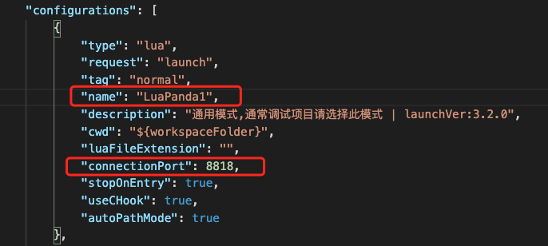

# 其他功能说明

## 多目标调试 (multi-target)

有时我们希望同时调试多个lua虚拟机。最简单的办法是启动多个vscode窗口，打开不同的项目，分别和各虚拟机建立连接，唯一要注意的是不同的虚拟机需要设置不同的端口通信（ 同时修改launch.json和 `require("LuaPanda").start(ip, port) `中的端口即可 ）

如果希望在一个VSCode窗口中连接多个lua虚拟机，就要用到多目标调试。如下图，一个 VSCode 窗口同时和两个虚拟机建立了连接，Project1 和 Project2 分别独立运行，通过切换堆栈可以分别观察它们的状态。

要如何进行多目标调试呢？ LuaPanda支持两种方式：

#### 1.  多个项目放在同一个workspace中

+ 打开workspace, 发现存在两个项目 project1 和  project2.  切换到调试选项卡，可以分别给两个项目增加配置。

+ 如果两个项目之前单独调试过，那么配置文件应该是已存在的。分别创建两个项目的配置后，修改他们的配置名和端口号，使之不同，避免相互干扰。

+ 在vscode窗口中运行两个目标。分别在两个lua虚拟机的代码中引用调试器（**注意保持端口一致**），之后启动虚拟机，即可分别建立连接，开始调试。

#### 2. 多个项目放置在同一个工程中

这种情况下，一个文件夹中的 lua 代码分别运行在两个虚拟机，配置方法如下

+ 打开上层公共文件夹 

+ 建立launch.json文件: 切换到debug选项卡，创建一份launch.json 配置文件

+ 修改 launch.json。 复制一份 LuaPanda 配置，并修改name和port, 使之不同，如下图

+ 在VScode中启动两个目标，在两个lua虚拟机运行的lua代码中分别引用调试器（**注意设置端口**），运行各lua虚拟机，即可开始调试。

## VSCode ssh远程调试

Vscode 有非常强大的远程插件机制，通过 Remote-SSH 插件就可以实现。远程插件这里不做详细介绍，LuaPanda 支持远程调试，唯一要注意的是打开的文件夹中不要包含中文或异常符号，在一些平台上（如 linux）会因为这些符号导致问题。